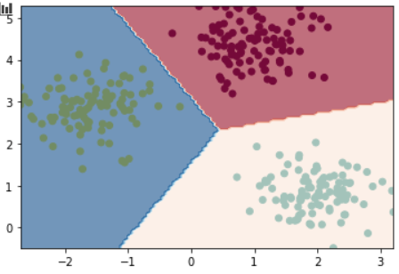

Bayesian statistics
===================

.. automodule:: statinf.stats.bayesian
    :members:
    :undoc-members:
    :show-inheritance:

Examples
--------

LDA
***

.. code-block:: python

    from statinf.stats import GMM
    from sklearn.datasets import make_blobs  # Use for synthetic data

    # Generate data with Scikit Learn
    X, labels = make_blobs(n_samples=[100, 100, 100], cluster_std=[0.5, 0.5, 0.5],
                                   centers=None, n_features=2, random_state=0)

    # Initialize and fit the GMM
    classifier = GGM()
    means, covariance = classifier.fit(X_train, y_train, nb_classes=3, isotropic=True)
    # Predict
    preds = classifier.predict(X_test, norm="euclidean")
    # Plot the decision boundaries
    classifier.plot_decision_boundary(X, labels, norm="euclidean")

Output will be:

   
   Decision boundaries for LDA with linear isotropy
